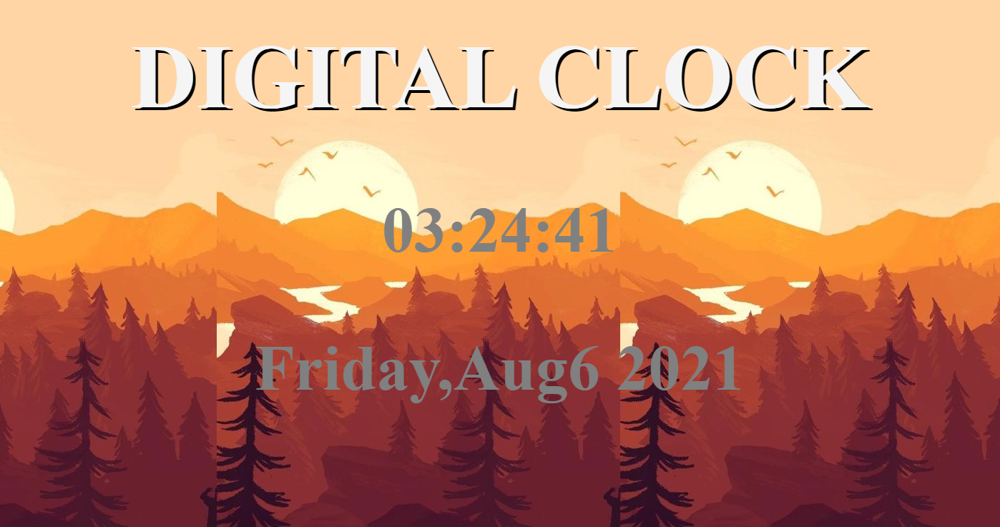

# Digital-Clock-App 
 Clock is build using HTML, CSS and JavaScript. 

# To Open a Clock Project Click [here](https://komalgill0310.github.io/Digital-Clock-App/)  

# How does the Digital Clock look

# Summary
This is the first project where I used JavaScript to give some functionality to my Digital Clock. In this application, I first created rough HTML and CSS and then I started working on to get the local date and time. Later on, I made the clock Tick. Also, in JS the Hours appear from 0-23H(military time clock) and I convertrd the military time clock to regular clock. Lastly, I made the hour, minutes and seconds which are less than 10 followed by the leading zeroes, and also converted the dates to ordinal numbers. It was a great start towards learning JS. 

# Author
Komal - | Software Developer | [Digital Clock](https://komalgill0310.github.io/Digital-Clock-App/) | [LinkedIn](www.linkedin.com/in/komalpreet-kaur-3b6924177)

